# UI-MAP — screens, tap targets and coordinates (1080x2400)

Generated by `bash tools/ui-map.sh`; tap with `bash tools/agent-tap.sh <screen> <text|id:part>`.

## about

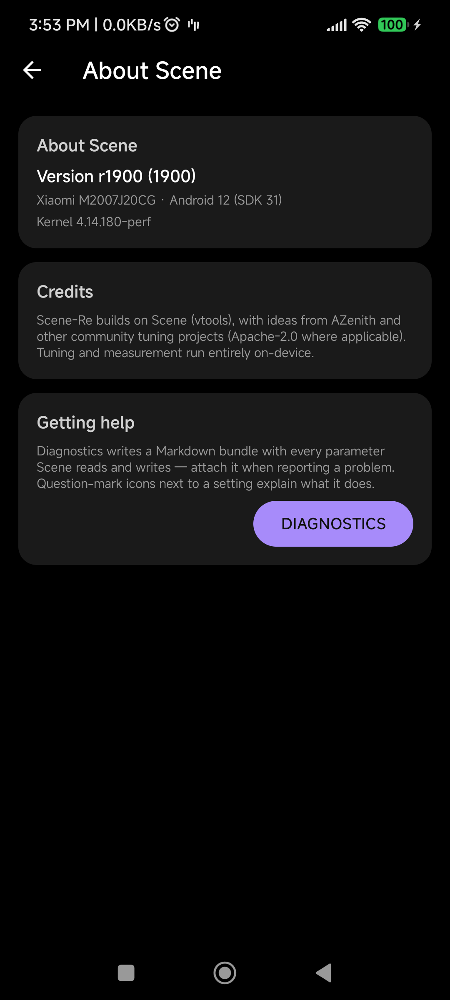

| element | id | tap (x,y) |
|---|---|---|
| Navigate up |  | 77,168 |
| DIAGNOSTICS | about_diagnostics | 800,1257 |

## appconfig

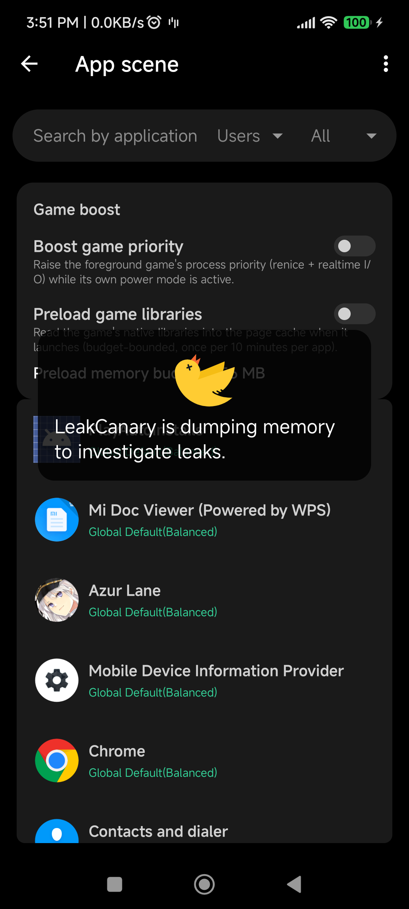

| element | id | tap (x,y) |
|---|---|---|
| Navigate up |  | 77,168 |
| More options |  | 1024,168 |
| Search by application name | config_search_box | 308,358 |
|  | configlist_type | 675,358 |
|  | configlist_modes | 923,358 |
| Boost game priority | settings_game_priority | 540,649 |
| Preload game libraries | settings_game_preload | 540,828 |
| Preload memory budget: 256 MB | settings_game_preload_mb | 540,984 |

## appdetails

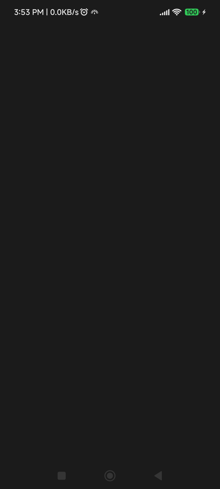

| element | id | tap (x,y) |
|---|---|---|
| Navigate up |  | 77,168 |
|  | action_save | 1003,168 |
|  | app_details_icon | 157,391 |
| Open the application to perform operations autom | scene_mode_allow | 540,603 |
| Adjust performance to |  | 312,842 |
| Global Default | app_details_dynamic | 764,835 |
| Memory (cgroup) in the foreground |  | 441,971 |
| System default | app_details_cgroup_mem | 893,971 |
| After the memory (cgroup) leaves |  | 424,1119 |
| System default | app_details_cgroup_mem2 | 876,1119 |
| Automatic acceleration (memory) |  | 420,1248 |
| Disabled | app_details_boost_mem | 872,1241 |
| HWUI renderer |  | 237,1531 |
| Default | app_details_hwui_renderer | 689,1524 |
| HWUI vulkan (reboot) |  | 302,1641 |
| Default | app_details_hwui_vulkan | 754,1634 |
| Turn off automatic brightness |  | 385,1924 |
|  | app_details_aloowlight | 837,1924 |
| Turn on GPS (restore after leaving) |  | 435,2034 |
|  | app_details_gps | 887,2034 |
| Rotate screen |  | 226,2139 |
| Default | scene_orientation | 678,2134 |

## automation

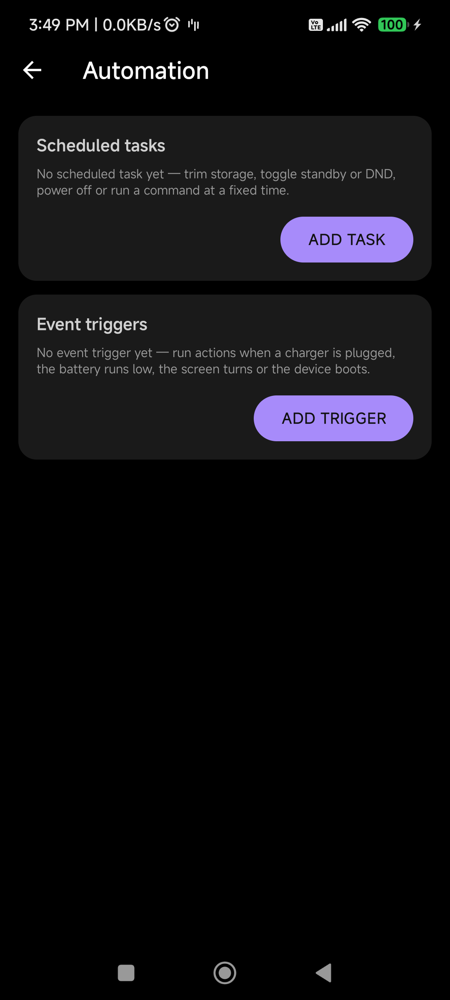

| element | id | tap (x,y) |
|---|---|---|
| Navigate up |  | 77,168 |
| ADD TASK | automation_add_task | 832,575 |
| ADD TRIGGER | automation_add_trigger | 800,1004 |

## benchmark

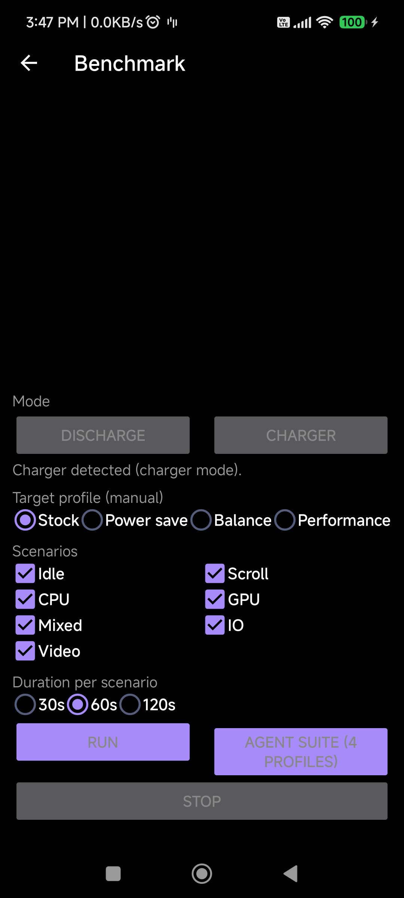

| element | id | tap (x,y) |
|---|---|---|
| Navigate up |  | 77,168 |
| DISCHARGE | bench_mode_discharge | 275,1163 |
| CHARGER | bench_mode_charger | 804,1163 |
| Stock | bench_target_stock | 122,1389 |
| Power save | bench_target_powersave | 357,1389 |
| Balance | bench_target_balance | 615,1389 |
| Performance | bench_target_performance | 886,1389 |
| Idle | bench_scenario_idle | 286,1532 |
| Scroll | bench_scenario_scroll | 793,1532 |
| CPU | bench_scenario_cpu | 286,1601 |
| GPU | bench_scenario_gpu | 793,1601 |
| Mixed | bench_scenario_mixed | 286,1670 |
| IO | bench_scenario_io | 793,1670 |
| Video | bench_scenario_video | 124,1739 |
| 30s | bench_duration_30 | 103,1882 |
| 60s | bench_duration_60 | 243,1882 |
| 120s | bench_duration_120 | 391,1882 |
| RUN | bench_run | 275,1983 |
| AGENT SUITE (4 PROFILES) | bench_suite | 804,2002 |
| STOP | bench_stop | 540,2127 |

## charge

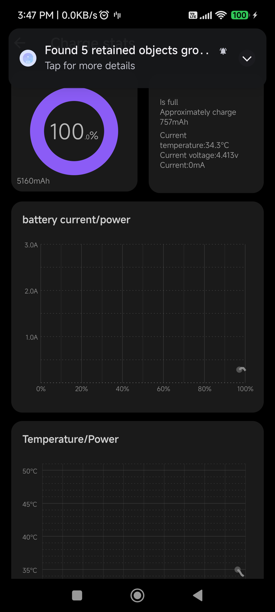

| element | id | tap (x,y) |
|---|---|---|
| Navigate up |  | 77,168 |

## chargehw

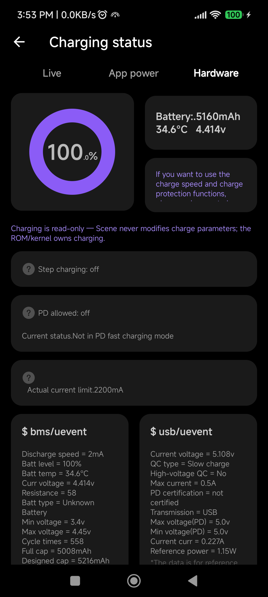

| element | id | tap (x,y) |
|---|---|---|
| Navigate up |  | 77,168 |
| Live | hub_tab_live | 209,293 |
| App power | hub_tab_apps | 539,293 |
| Hardware | hub_tab_hardware | 870,293 |
| DESC | android:id/button1 | 115,1081 |
| DESC | android:id/button1 | 115,1257 |
| DESC | android:id/button1 | 115,1518 |

## cpucontrol

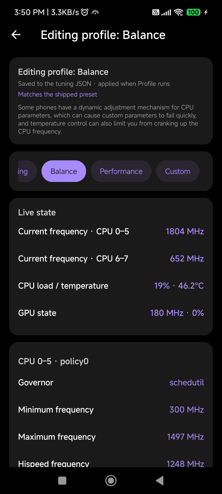

| element | id | tap (x,y) |
|---|---|---|
| Navigate up |  | 77,168 |
| Power saving |  | 134,831 |
| Balance |  | 310,831 |
| Performance |  | 589,831 |
| Custom |  | 864,831 |

## diagnostics

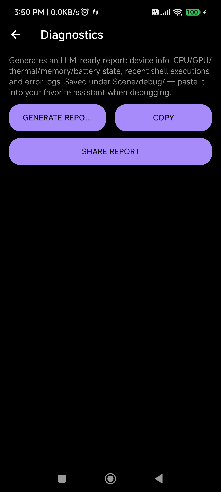

| element | id | tap (x,y) |
|---|---|---|
| Navigate up |  | 77,168 |
| GENERATE REPORT | diag_generate | 281,574 |
| COPY | diag_copy | 799,574 |
| SHARE REPORT | diag_share | 540,739 |
|  | diag_report | 540,1536 |

## fpschart

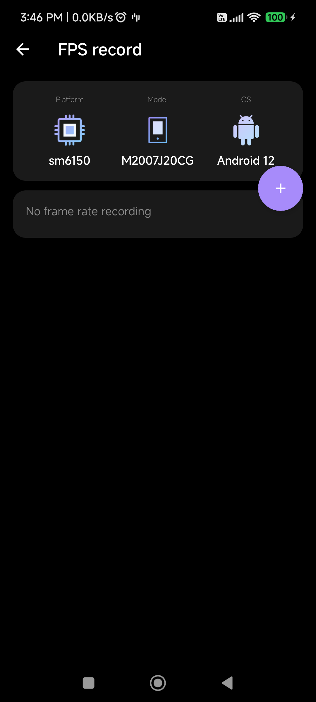

| element | id | tap (x,y) |
|---|---|---|
| Navigate up |  | 77,168 |
|  | chart_add | 959,644 |

## home

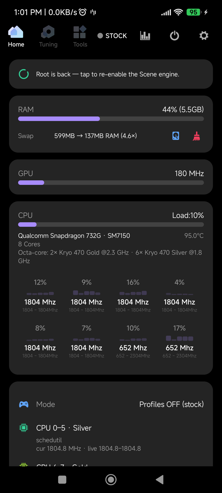

| element | id | tap (x,y) |
|---|---|---|
| STOCK | engine_state_chip | 840,173 |
| Settings | action_settings | 992,173 |

## miuithermal

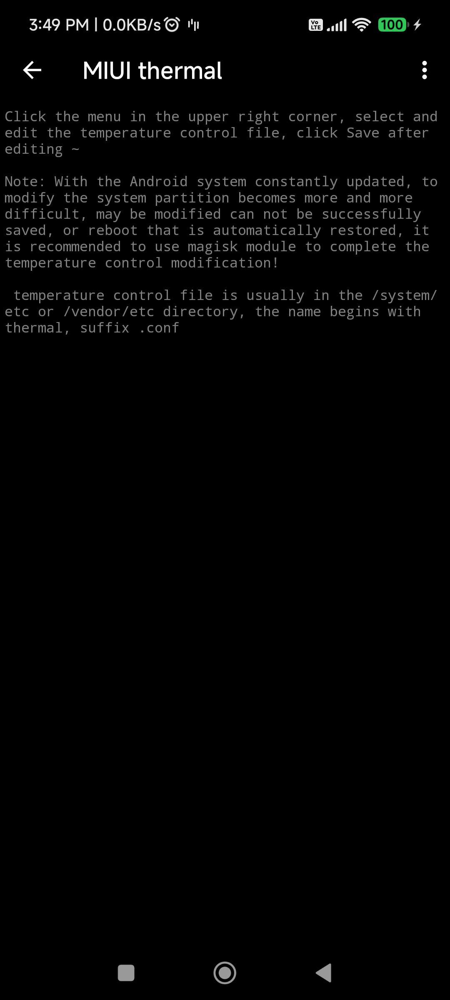

| element | id | tap (x,y) |
|---|---|---|
| Navigate up |  | 77,168 |
| More options |  | 1024,168 |
| Click the menu in the upper right corner, select | thermal_config | 540,1212 |

## powerutil

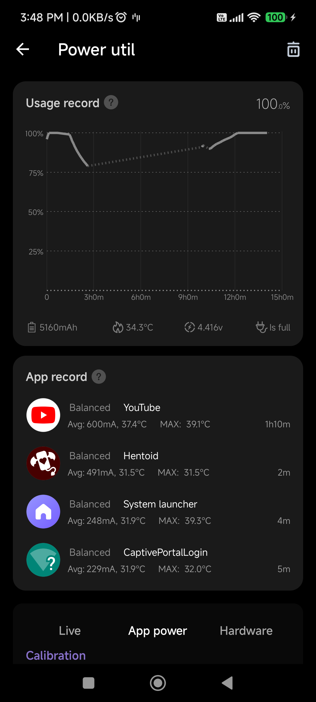

| element | id | tap (x,y) |
|---|---|---|
| Navigate up |  | 77,168 |
|  | action_delete | 1003,168 |
| DESC | android:id/button1 | 379,349 |
| DESC | android:id/button1 | 337,1287 |
| Live | hub_tab_live | 238,2154 |
| App power | hub_tab_apps | 539,2154 |
| Hardware | hub_tab_hardware | 841,2154 |
| Calibration | electricity_adj_unit | 0,0 |

## settings

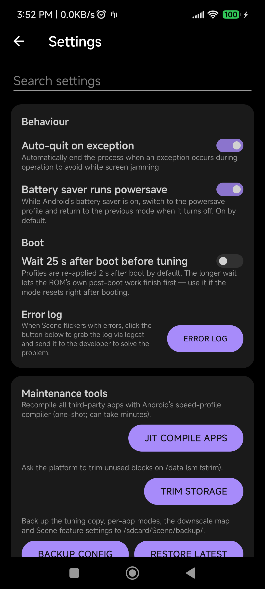

| element | id | tap (x,y) |
|---|---|---|
| Navigate up |  | 77,168 |
| Search settings | settings_filter | 540,329 |
| Auto-quit on exception | settings_auto_exit | 540,592 |
| Battery saver runs powersave | settings_saver_overlay_enabled | 540,771 |
| Wait 25 s after boot before tuning | settings_boot_delay | 540,1063 |
| ERROR LOG | settings_logcat | 836,1380 |
| JIT COMPILE APPS | settings_jit_compile | 757,1785 |
| TRIM STORAGE | settings_fstrim | 789,2002 |
| BACKUP CONFIG | settings_backup | 0,0 |
| RESTORE LATEST | settings_restore | 0,0 |

## swap

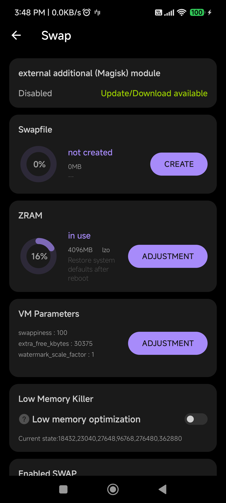

| element | id | tap (x,y) |
|---|---|---|
| Navigate up |  | 77,168 |
| CREATE | btn_swap_create | 855,783 |
| ADJUSTMENT | btn_zram_resize | 802,1223 |
| ADJUSTMENT | swappiness_adj | 802,1638 |
| DESC | android:id/button1 | 115,1999 |
| Low memory optimization | swap_auto_lmk | 573,1999 |

## tools

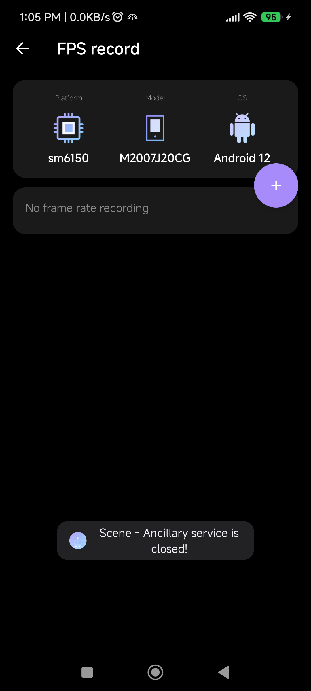

| element | id | tap (x,y) |
|---|---|---|
| STOCK | engine_state_chip | 840,173 |
| Settings | action_settings | 992,173 |

## tuner

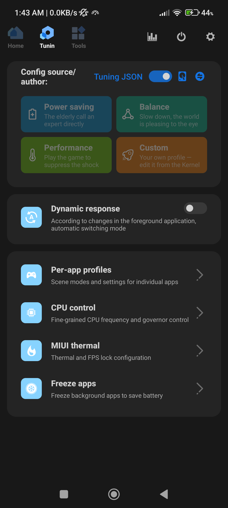

| element | id | tap (x,y) |
|---|---|---|
| STOCK | engine_state_chip | 840,173 |
| Settings | action_settings | 992,173 |
| Tuning JSON · sm6150 |  | 246,351 |
| Edit |  | 921,477 |
| Edit |  | 921,609 |
| Edit |  | 921,741 |
| Edit |  | 921,874 |
| Dynamic response | dynamic_control | 611,1271 |
|  | nav_app_profiles | 540,1637 |
|  | nav_cpu_control | 540,1846 |
|  | nav_miui_thermal | 540,2055 |

## tweaks

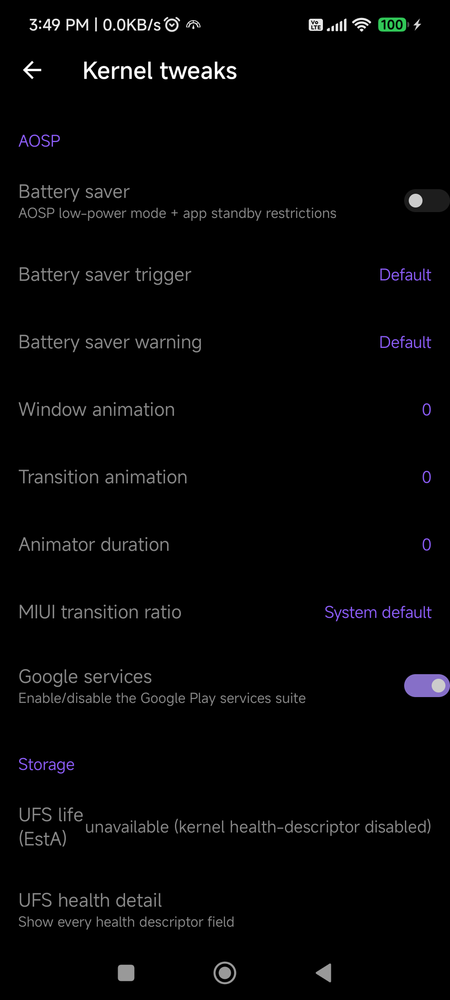

| element | id | tap (x,y) |
|---|---|---|
| Navigate up |  | 77,168 |
| toggle:Battery saver |  | 997,481 |
| toggle:Google services |  | 997,1645 |
